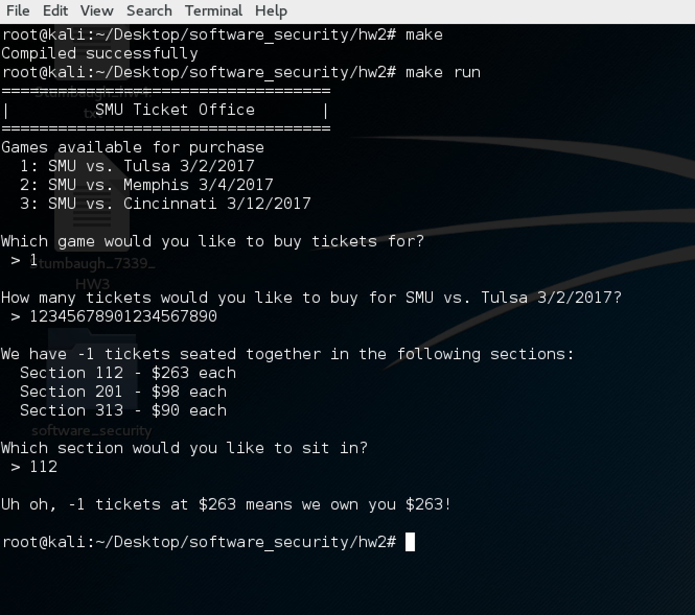

Exploitation Instructions for the SMU Ticket Office
===================================================

The buffer overflow is on the second input, the number of tickets. The length of
the buffer is initially 20. Each time the program is run, the length will be
increased by one. The `tmp.txt` file initially contains `0`, and each time the
program is run, increases by one. In the even that the user figures out that the
length is continually increasing and runs the program without the `tmp.txt` file
present, a random number between 1 and 5 will be generated and added to the base
buffer length of 20. In order to exploit this, a string of length 20 will
overflow the buffer the first time, length 21 the second time, and so on.

### Normal Execution

### Exploitation

